# Homelab-SOC
SOC home lab for learning and practicing SOC analyst skills: log collection, detection, threat hunting, incident response, and automation.

## 🎯 Project Objectives

This lab simulates a production SOC environment to develop hands-on experience in:

- **Log Management**: Centralized collection and normalization of security events
- **Threat Detection**: Real-time monitoring and alerting on suspicious activities
- **Incident Response**: Investigation and remediation of security incidents
- **Attack Simulation**: Controlled penetration testing for realistic threat scenarios
- **SIEM Mastery**: Advanced Splunk queries (SPL), dashboards, and correlation rules

## 🧩 Architecture

```mermaid
flowchart TB
    Attack["⚔️ Attack Simulation"]
    Collect["📥 Log Collection"]
    Analyze["🔍 Threat Analysis"]
    Learn["🎓 Skill Development"]
    
    Attack --> Collect
    Collect --> Analyze
    Analyze --> Learn
    Learn -.->|iterate| Attack
    
    style Attack fill:#e74c3c,stroke:#c0392b,stroke-width:3px,color:#fff
    style Collect fill:#3498db,stroke:#2980b9,stroke-width:3px,color:#fff
    style Analyze fill:#f39c12,stroke:#e67e22,stroke-width:3px,color:#fff
    style Learn fill:#27ae60,stroke:#229954,stroke-width:3px,color:#fff
```

### Infrastructure Components

**Stack:**
- **SIEM**: Splunk Enterprise on Debian 13
- **Endpoints**: Windows + Linux 
- **Attack Platform**: Kali Linux
- **Network**: Isolated VMware Host-Only

---

## 🔍 Key Features

✅ Multi-platform log collection (Windows, Linux)  
✅ Custom detection rules and dashboards  
✅ Isolated network for safe testing  
✅ Real-world attack simulations  
✅ MITRE ATT&CK framework mapping  

## 📊 Use Cases

| Scenario | Detection Method |
|----------|-----------------|
| **Brute Force** | Failed login threshold monitoring |
| **Privilege Escalation** | Unusual sudo/admin activity |
| **Lateral Movement** | Abnormal network connections |
| **Malware Execution** | Suspicious process creation |

---

## 🎓 Skills Demonstrated

**SIEM**: Splunk deployment, SPL queries, dashboards  
**Detection**: Custom rules, correlation, alerting  
**Analysis**: Log investigation, timeline reconstruction  
**Offensive**: Kali Linux, attack simulation, TTPs  

---

## 📚 Documentation

Detailed setup guides and playbooks available in [`/docs`](./docs):
- [Installation Guide](docs/installation.md)
- [Detection Rules](docs/detection-rules.md)
- [SPL Cheat Sheet](docs/spl-cheatsheet.md)
- [Attack Scenarios](docs/attack-scenarios.md)

---

## 📈 Roadmap

- [x] SIEM infrastructure setup
- [x] Multi-platform log collection
- [ ] Custom detection rules library
- [ ] Automated alerting system
- [ ] Attack simulation scenarios
- [ ] SOAR integration

---

## 🤝 Connect

**LinkedIn**: [Your Profile](https://www.linkedin.com/in/malo-martin/)  
**Email**: malomartin.contact@gmail.com

---

*Built for cybersecurity learning and career development* 🔐

