# Homelab-SOC
SOC home lab for learning and practicing SOC analyst skills: log collection, detection, threat hunting, incident response, and automation.


## 🎯 Project Objectives

This lab simulates a production SOC environment to develop hands-on experience in:

- **Log Management**: Centralized collection and normalization of security events
- **Threat Detection**: Real-time monitoring and alerting on suspicious activities
- **Incident Response**: Investigation and remediation of security incidents
- **Attack Simulation**: Controlled penetration testing for realistic threat scenarios
- **SIEM Mastery**: Advanced Splunk queries (SPL), dashboards, and correlation rules

## 🧩 Architecture

```mermaid
flowchart TB
    Attack["âš”ï¸ Attack Simulation"]
    Collect["📥 Log Collection"]
    Analyze["🔠Threat Analysis"]
    Learn["🎓 Skill Development"]
    
    Attack --> Collect
    Collect --> Analyze
    Analyze --> Learn
    Learn -.->|iterate| Attack
    
    style Attack fill:#e74c3c,stroke:#c0392b,stroke-width:3px,color:#fff
    style Collect fill:#3498db,stroke:#2980b9,stroke-width:3px,color:#fff
    style Analyze fill:#f39c12,stroke:#e67e22,stroke-width:3px,color:#fff
    style Learn fill:#27ae60,stroke:#229954,stroke-width:3px,color:#fff
```

### Infrastructure Components

| Component | Technology | Purpose |
|-----------|-----------|---------|
| **Hypervisor** | VMware Workstation Pro 17 | Isolated virtual network environment |
| **SIEM Platform** | Splunk Enterprise 10.0.1 | Centralized log collection and analysis |
| **Indexer** | Debian 13 (8GB RAM, 4 vCPU, 80GB) | Event storage and processing |
| **Windows Endpoint** | Windows 10 | Monitored workstation generating events |
| **Linux Endpoint** | Ubuntu | Server monitoring and Linux security events |
| **Attack Platform** | Kali Linux | Penetration testing and attack simulation |
| **Network** | Host-Only VMnet (isolated) | Secure environment |

---

## 🔧 Implementation Details

### 1. SIEM Infrastructure Setup

**Splunk Enterprise Configuration:**
```bash
# Installed on Debian 13
- Version: 10.0.1
- License: Enterprise Trial → Free (500 MB/day)
- Listening Port: 9997 (receiving logs)
- Web Interface: 8000
```

**Index Strategy:**
- `windows_logs`: Windows Event Logs (Security, System, Application)
- `linux_logs`: Syslog, auth logs, system events
- `network_logs`: Firewall, IDS/IPS, network traffic
- `attack_logs`: Penetration testing results and IOCs

**Firewall Configuration:**
```bash
ufw allow 22/tcp    # SSH management
ufw allow 8000/tcp  # Splunk Web UI
ufw allow 9997/tcp  # Log receiving port
```

---

### 2. Endpoint Monitoring

**Windows Endpoint:**
- **Agent**: Splunk Universal Forwarder
- **Service Account**: Virtual Account (least privilege)
- **Privileges**: SeBackupPrivilege, SeSecurityPrivilege
- **Data Sources**:
  - Security Event Log (authentication, privilege escalation)
  - System Event Log (services, drivers, hardware)
  - Application Event Log (software errors, crashes)
  - Performance Counters (CPU, memory anomalies)
