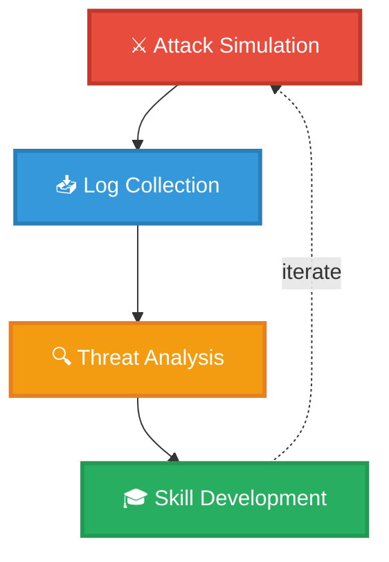

# Homelab-SOC
SOC home lab for learning and practicing SOC analyst skills: log collection, detection, threat hunting, incident response, and automation.

## 🧩 Architecture

```mermaid
flowchart TB
    Attack["⚔️ Attack Simulation"]
    Collect["📥 Log Collection"]
    Analyze["🔍 Threat Analysis"]
    Learn["🎓 Skill Development"]
    
    Attack --> Collect
    Collect --> Analyze
    Analyze --> Learn
    Learn -.->|iterate| Attack
    
    style Attack fill:#e74c3c,stroke:#c0392b,stroke-width:3px,color:#fff
    style Collect fill:#3498db,stroke:#2980b9,stroke-width:3px,color:#fff
    style Analyze fill:#f39c12,stroke:#e67e22,stroke-width:3px,color:#fff
    style Learn fill:#27ae60,stroke:#229954,stroke-width:3px,color:#fff
```
