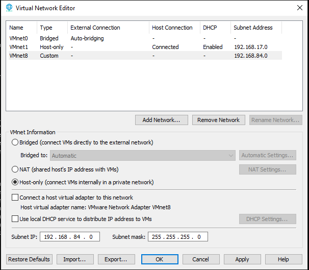
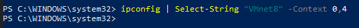

# 🔧 Installation Guide

Complete step-by-step guide to build your own SOC home lab.

---

## 📋 Table of Contents

- [Prerequisites](#prerequisites)
- [1. VMware Network Setup](#1-vmware-network-setup)
- [2. Splunk Server Setup](#2-splunk-server-setup)
- [3. Windows Forwarder Setup](#3-windows-forwarder-setup)
- [4. Linux Forwarder Setup](#4-linux-forwarder-setup)
- [5. Verification](#5-verification)
- [Troubleshooting](#troubleshooting)

---

## Prerequisites

### Hardware Requirements

**Host Machine (Physical PC):**

| Component | Minimum | Recommended |
|-----------|---------|-------------|
| **RAM** | 16 GB | 32 GB |
| **Storage** | 250 GB free | 300 GB SSD |
| **CPU** | Quad-core  | Hexa-core+ |

**Individual VMs:**

| VM | Purpose | RAM | Storage | CPU |
|----|---------|-----|---------|-----|
| **Debian 13** | Splunk Server | 8 GB | 80 GB | 4 vCPU |
| **Windows 10** | Monitored Endpoint | 4 GB | 60 GB | 2 vCPU |
| **Kali Linux** | Attack Platform | 4 GB | 40 GB | 2 vCPU |
| **Ubuntu Desktop** | Monitored Endpoint | 4 GB | 40 GB | 2 vCPU |
| **Total** | - | ~20 GB | ~220 GB | 10 vCPU |

> 💡 **Tip:** Start with Debian + Ubuntu (12 GB RAM, 120 GB storage) to learn SIEM basics. Add Windows 10 VM and Kali later for attack simulations.

> ⚠️ **Important:** Do NOT install Universal Forwarder on your physical host machine. Use dedicated VMs as monitored endpoints to keep your main system safe from attack simulations.

---

### Software Requirements

**Virtualization:**
- VMware Workstation Pro 17 (or VMware Player/VirtualBox)

**Operating Systems:**
- Debian 13 ISO (for Splunk Server)
- Windows 10 ISO (for monitored endpoint)
- Kali Linux ISO (for penetration testing)
- Ubuntu 22.04/24.04 Desktop ISO (for monitored endpoint)

**Splunk Components:**
- Splunk Enterprise 10.0.1 (.deb for Linux)
- Universal Forwarder 10.0.1 (.msi for Windows VM)
- Universal Forwarder 10.0.1 (.deb for Linux VMs)

---

### Download Links

| Software | Link |
|----------|------|
| **VMware Workstation Pro** | [Download Trial](https://www.vmware.com/products/workstation-pro/workstation-pro-evaluation.html) |
| **Splunk Enterprise** | [Download (.deb)](https://www.splunk.com/en_us/download/splunk-enterprise.html) |
| **Universal Forwarder** | [Download (all platforms)](https://www.splunk.com/en_us/download/universal-forwarder.html) |
| **Debian 13** | [Download ISO](https://www.debian.org/download) |
| **Kali Linux** | [Download Installer](https://www.kali.org/get-kali/#kali-installer-images) |
| **Ubuntu Desktop** | [Download ISO](https://ubuntu.com/download/desktop) |
| **Windows 10** | [Download ISO](https://www.microsoft.com/software-download/windows10) |

> ⚠️ **Note:** You'll need a free Splunk account to download Splunk software. License is free for up to 500 MB/day.

> 💡 **Windows 10:** Microsoft provides free evaluation ISOs (180 days trial). Perfect for lab testing without purchasing a license.

---

## 1. VMware Network Setup

### 1.1 Create Host-Only Network

**Create an isolated network for the lab (no internet access).**

**Steps:**

1. Open VMware Workstation
2. Go to `Edit → Virtual Network Editor`
3. Click `Change Settings` (Administrator required)
4. Select **VMnet8** in the list
5. Change type from `NAT` to `Host-only`

> **Note:** Lab uses NAT for internet access (system updates, package downloads).  
> For full isolation, switch to Host-Only after initial setup.

```
Type: Host-only
Subnet IP: 192.168.84.0
Subnet Mask: 255.255.255.0
☐ Use local DHCP (unchecked)
☐ Connect host adapter
```



6. Click `OK`

---

### 1.2 Verify Configuration

**On your Windows host PC, verify the VMnet8 adapter:**
```powershell
ipconfig | Select-String "VMnet8" -Context 0,4
```

**Expected output:**


```
No output → VMnet8 adapter does not exist on host
→ Kali cannot ping or attack your PC
```
---

### 1.3 Network Topology

**IP Address Plan:**

| Device | IP Address | Hostname | Role |
|--------|------------|----------|------|
| **Windows Host** | none | (Your PC) | VMware hypervisor + Splunk UI |
| **Debian VM** | 192.168.84.130 | splunk-server | SIEM platform |
| **Windows 10 VM** | 192.168.84.50 | win10-endpoint | Monitored endpoint |
| **Ubuntu VM** | 192.168.84.30 | ubuntu-endpoint | Monitored endpoint |
| **Kali VM** | 192.168.84.100 | kali-attacker | Attack simulation |

> ⚠️ **Security Note:**  
> - The physical host is used ONLY for VMware and accessing Splunk Web UI  
> - All monitored endpoints and attacks happen in isolated VMs  
> - This protects your main system from attack simulations
---

### 1.4 Assign Network to VMs

**For each VM:**

1. Right-click VM → Settings → Network Adapter
2. Select: `Custom: VMnet8 (Host-only)`


### 1.5 Access Splunk from Host

1. Power off splunk-server
2. Right-click `VM → Settings → add Network Adapter`
3. Check: ☑ NAT
 → Cela crée une interface uniquement dédiée à l’accès Splunk depuis l’hôte, sans exposer tout le réseau du lab.

4. Démarrer la VM Splunk

5. Afficher l'adresse NAT depuis la VM :
   ```bash
   ip a


| Field| Value|
|--------|--------|
| **Host port** | 8000 |
| **Guest ip** | 192.168.84.130 |
| **Guest port** | 8000 |
| **Protocol** | TCP |

5. Click `OK` → Start VM

> -  Now you can acess at splunk UI on your host (http://localhost:8000)
